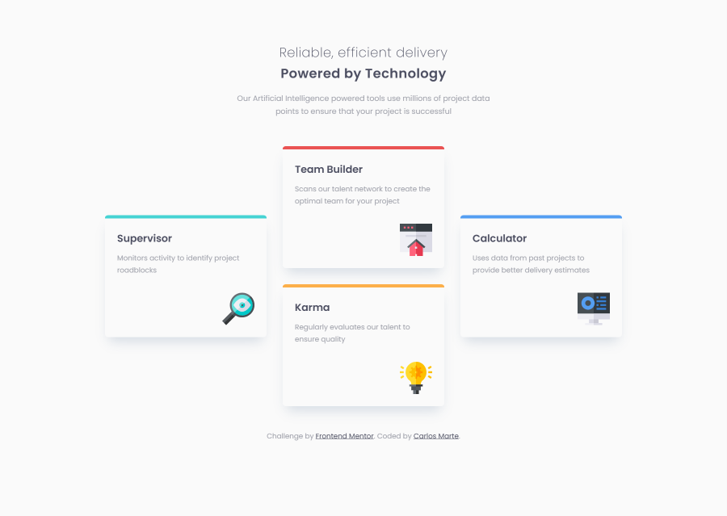
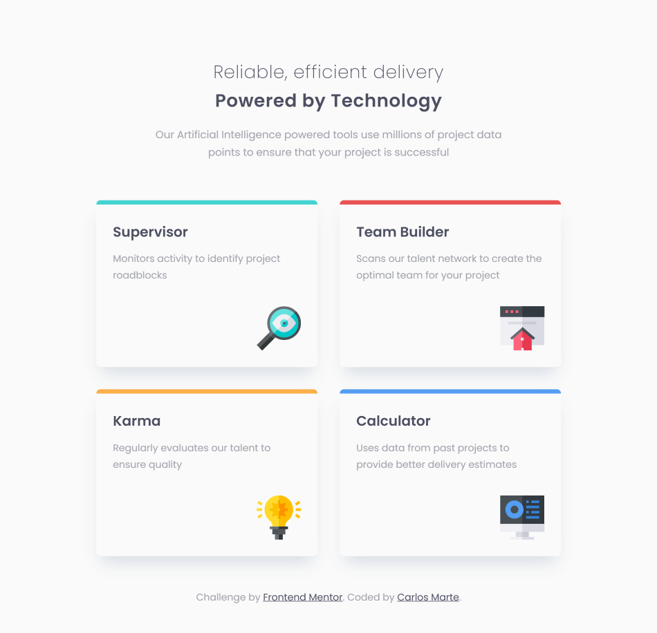
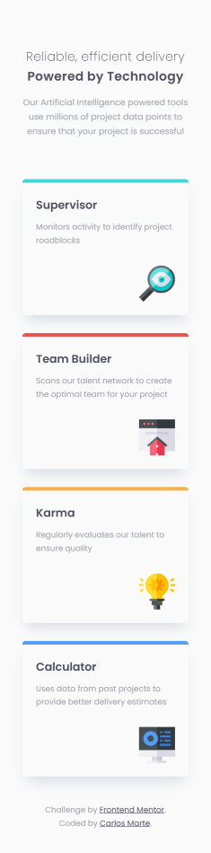

# Frontend Mentor - Four card feature section solution

This is a solution to the [Four card feature section challenge on Frontend Mentor](https://www.frontendmentor.io/challenges/four-card-feature-section-weK1eFYK). Frontend Mentor challenges help you improve your coding skills by building realistic projects.

## Table of contents

- [Overview](#overview)
  - [The challenge](#the-challenge)
  - [Screenshot](#screenshot)
  - [Links](#links)
- [My process](#my-process)
  - [Built with](#built-with)
  - [What I learned](#what-i-learned)
  - [Continued development](#continued-development)
- [Author](#author)

## Overview

### The challenge

Users should be able to:

- View the optimal layout for the site depending on their device's screen size

### Screenshot

### Links

- Solution URL: [Solution Code](https://github.com/carlosmarte23/four-card-feature-section-master)
- Live Site URL: [Githubs pages](https://carlosmarte23.github.io/four-card-feature-section-master/)

## My process

### Built with

- Semantic HTML5 markup
- CSS custom properties
- Flexbox
- CSS Grid
- Mobile-first workflow
- [Sass](https://sass-lang.com/)

### What I learned

In this challenge I tried to use Sass with a more detailed structure, I used separated files for variables, components and mixins.

It was aso my first time using mixins, I used them for the cards with diferent colored top borders.

### Continued development

Ill try to use Sass more in the future, I think its a good way to organize the stylesheets and make it easier to mantain.

## Author

- Website - [Github Profile](https://github.com/carlosmarte23)
- Frontend Mentor - [@carlosmarte23](https://www.frontendmentor.io/profile/carlosmarte23)
